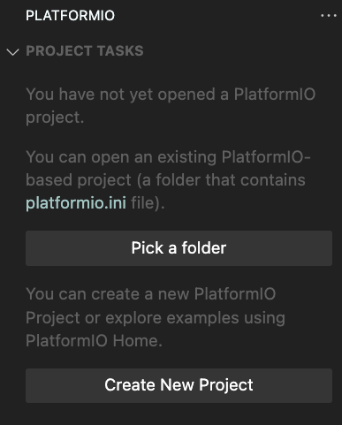
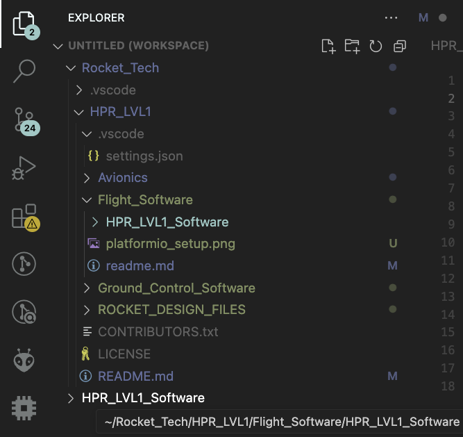
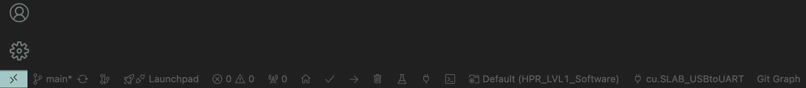

# Flight Software Main:

## How To Setup:
We've shifted from `ArduinoIDE` to `Visual Studio Code` to have our code setup in multiple files and also have version control on it. However now there's a little setup required in order to play around with the code:

A micro-controller can only be flashed with one machine code(which have CPU isntructions in binary).
In our case we have the software organized into multiple `c++` files so there are a few steps required that needs to be done before we can get that single machine code out of all.

"""<br>
__*A little Computer Science lesson:*__ The files have to be linked to their header files, then all of them have to be compiled into C code, which then assembles into a specific Assembly Language, unique to the CPU that's on your microcontroller. 
All these steps constitutes a big part of the `build` process, a term used in typical software engineering.
"""

### <u>STEPS</u>:

__STEP 0:__ Steps differ for different users:
- If you just want to use this codebase, don't fork it, just clone it.
- But if you want to contribute in this codebase then fork it to your GitHub account before cloning.

__STEP 1:__ Install the USB to UART communication driver for the microcontroller you're trying to use.<br>
([link for the USB to UART driver for ESP32-WROOM-DevKit](https://www.silabs.com/developers/usb-to-uart-bridge-vcp-drivers))<br>
*This is required for your operating system to be able to communicate with your microcontroller via UART communication protocol over a USB port.* <br>
__<u>NOTE</u>__ The one provided in the link might not work with other microcontrollers)

__STEP 2:__ Install `PlatformIO` on your VScode and restart the VScode.

__STEP 3:__ Setting up the project folder:
- Open the cloned repository in your VScode. Then click on the PlatformIO(bee looking icon) extension, you'll see two options:

- <table><tr><td> Click on "Pick a folder": </td> <td> </td> </tr></table> <br>

    - Now you'll be asked to select a folder to open, open the `HPR_LVL1_Software`.     

        __<u>WARNING:</u>__ If you open any other folder then you'll get into trouble because duplicate setup files will be created due to not having `platformio.ini` file in it.<br>
        __<u>NOTE:</u>__ It might seem that the folder `HPR_LVL1_Software` has been duplicated BUT IT DID NOT(see the address in the screenshot below)!
        <br>
        It's just that the PlatformIO likes to open its project folder separately, even if it is open already!

__<u>STEP 4:</u>__ Building & Pushing:
New buttons should appear in the bottom ribbon of the visual studio code:
- If you'll click on the tick button, it'll build the executible(to learn more, read the aforementioned Comp Sci paragraph).
- If you'll click the Right Pointing Arror button, the executible will be flashed into your USB connected micrcontroller(if your port, driver and USB cable are all working properly).

Enjoy some `c++` :)

<hr>

# Protocols and Event Sequences:
Hardware setup:
- Setting the rocket's rail buttons into the launch rail.
- Turn the Screw Switch in the avionics.
- Upright the launch rail, with the rocket.
- Insert the ignitor up the rocket engine through the nozzle hole.
- Connect those ignition leads to the power, using ground avionics.

### 1. Launch Sequence:
- Make sure all the Pyro Channels are set to LOW in the very first lines of the setup().
- Have a hard coded function for checking if upright using accelerometer data or not, call that function in the setup().
  ```
  while(Upright()){
    <!-- Just wait in this infinite loop until upright -->
  }
  ```
- System Health Checkup
    - Battery Levels
    - Test run all the sensors
    - Test run Data Logging:
        - SD card Module
        - Flash Memory Module
    - Send the reports over radio
- Listen for confirmation or abort command from the control room
- If confirmed, start the count down
- Long Beep the buzzer before Data Logging Starts
- Start Data Logging in Flash memory module.
    - Do not use the SD card just yet(keep it powered off, like don't even start the serial communication with it)
- Long Beep the buzzer after Data Logging Starts Successfully.
- Start the radio broadcast of the position estimation.
- Long Beep the buzzer after Radio Broadcast Starts Successfully.
- Start the count down from 10, 9, ...
  - 7 short beeps(one at every second) with increasing frequency, to 
  - Before the 3, 2, and 1: 
    - start the camera recording
    - Recalibrate all the sensors and the reference for the estimation models.
  - Finish the count down.
- Switch the ignition PIN(gate terminal of the MOSFET) value from LOW to HIGH.

### 2. Ejection Sequence:
- Detect Apogee using the following conditional(multiple trigger conditions for reducing the faliure rates):
  - Average Numerical Time Derivative of the Estimated position's altitude becomes zero(averaged over past 10 timestamps).
    - OR
  - Average Numerical Time Derivative of the Acceleration sensor value becomes zero(averaged over past 10 timestamps).
    - OR
  - Pressure sensor value stops dropping, for 15 timestamps in a row.
- Eject the parachute when the apogee is detected, after n seconds of delay.
    - By switching the MOSFET gate PIN to a HIGH(which otherwise will have a pulldown resistor attached to it).
    - Make sure all the Pyro Channels are set to LOW in the very first lines of the setup().
- Start detecting the touch down.
- Broadcast the position estimation data over radio, with a high refresh rate.

### 3. Post Touch Down Sequence:
- Stop the data logging after 10 seconds of touch down.
- Keep broadcasting the last postition estimation for 5 more minutes.
- Stop radio broadcast.
- Start transfering the data from Flash Memory module to the SD card.
- Start beeping every 2 seconds after 10 minutes have passed.

# Task List:
1. Write the code & draw schematics for each of the following modules individually `(AVIONICS TEAM)`:
    - SD card(5V ready Micro-SD Breakout Board, from adafruit)
    - Flash Memory Chip : WQ25 Module
    - GPS Sensor(GT-U7 161212989 from Goouu Tech)
    - Accelerometer and Gyroscope Sensor Module(MPU6050 Module)
    - Magnetometer Module(???)
    - Radio Frequency Module(E22 900T30D Version 2 from Ebyte)
    - Pressure Sensor(BMP280)
    - Load Cell Sensor(HX711 amplifier and 2024020278 Load Cell)
    - HawkEye4k Camera Module
2. Mathematics behind Algorithm for fusing live sensor data for `(SOFTWARE TEAM)`:
    - Acceleration Estimation
    - Velocity Estimation
    - Position & Orientation Estimation
3. Software for the data fusion(in the form of reusable functions)`(SOFTWARE TEAM)`.
4. Integrate all the sensor code together`(SOFTWARE TEAM)`:
    - As per the Launch Protocol
    - Using the data fusion functions